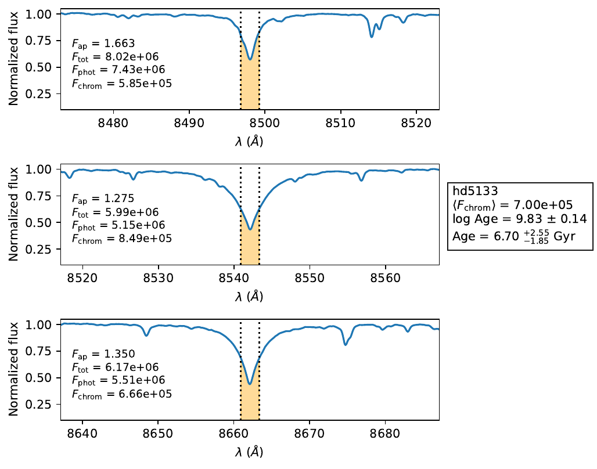

# gaia-rvs-chromospheric-ages
Python tool to compute chromospheric fluxes and stellar ages from **Gaia RVS spectra** using the **Ca II infrared triplet lines (Ca II IRT)**.

The code measures chromospheric emission in the three Ca II IRT lines (8498, 8542, and 8662 Å), converts the fluxes to the COUDE1 reference scale, and estimates stellar ages using the chromospheric calibration developed in Souza dos Santos et al. (2026) (in prep.).

---

# Requirements

The code requires the following Python packages:

- numpy
- scipy
- matplotlib
- joblib

---

# Input data

The program expects two types of inputs:

### 1. Stellar parameters table

A text file (input.txt) containing the stellar parameters, following this example:
```text
spectrum teff feh logg mass radius
hd2615.txt 6306 -0.57 3.94 1.08 1.83
bd+23527.txt 5870 -0.01 4.48 1.02 0.96
hd5133.txt 5900 -0.10 4.30 0.95 1.10
```

Parameters:

| Column | Description |
|------|-------------|
| spectrum | spectrum filename |
| teff | effective temperature (K) |
| feh | metallicity [Fe/H] |
| logg | surface gravity |
| mass | stellar mass (solar units) |
| radius | stellar radius (solar units) |


### 2. Spectra

Spectra must be placed inside a folder called **spectra/**.

Each spectrum must be a txt file containing two columns separated by a comma containing wavelength and normalized flux, following the example:
```text
lamb_air,flux
8457.675933875988,0.99486476
8457.775906843408,0.9959605
8457.875879810821,0.99694073
8457.975852778232,0.99634045
8458.075825745636,0.996022
8458.175798713033,0.99599385
...
```

The spectra must be converted to the air reference wavelenght (rather than vacuum). 

---

# Running the code

Run the program with:
```bash
python gaia_chromospheric_ages.py input.txt output.txt
```
Optional plotting:
```bash
python gaia_chromospheric_ages.py input.txt output.txt --plot
```
Plots will be saved in **plots/**.

---

# Output

The code generates an output table with the following columns:
```text
spectrum teff feh logg mass rad
Fap_8498 Fap_8542 Fap_8662
Fsc_8498 Fsc_8542 Fsc_8662
Ftot_8498 Ftot_8542 Ftot_8662
Fphot_8498 Fphot_8542 Fphot_8662
Fchrom_8498 Fchrom_8542 Fchrom_8662
Fchrom_mean log_age flag
```

Where:

- **Fap** — apparent flux measured in the Gaia spectrum
- **Fsc** — flux converted to the COUDE1 scale
- **Ftot** — total absolute flux
- **Fphot** — photospheric contribution
- **Fchrom** — chromospheric flux
- **Fchrom_mean** — mean chromospheric flux from the three lines
- **log_age** — chromospheric age estimate

---

# Flags

The output includes a flag indicating the validity of the calibration:

| Flag | Meaning |
|-----|------|
| OK | flux within calibration domain |
| LOW_ACTIVITY_REGIME | extrapolated regime |
| OUT_OF_DOMAIN | outside calibration domain |

The calibration becomes unreliable for:

Fchrom < 5.3 × 10^5 erg cm^-2 s^-1.

---

# Optional plots

Using the `--plot` option produces diagnostic plots showing:

- spectrum around each Ca II IRT line
- integration region
- measured fluxes
- derived chromospheric age

Example:



---

# Citation

If you use this code in your research, please cite:

Souza dos Santos, P. V., et al. (2026), in preparation.

You may also cite the GitHub repository:

Souza dos Santos, P. V. (2026). **gaia-rvs-chromospheric-ages**.  
https://github.com/paulovitss/gaia-rvs-chromospheric-ages

---

# License

MIT License

---

# Author

P. V. Souza dos Santos.
Universidade Federal do Rio de Janeiro, Observatório do Valongo, Rio de Janeiro, Brazil.
